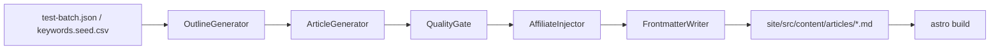

# テスト記事自動生成 — 設計

格安 SIM × 光回線メディア向け。KW → 構成 JSON → Markdown → Astro 公開。

## フロー



## 生成モード

| モード     | 条件                             | 用途                           |
| ---------- | -------------------------------- | ------------------------------ |
| `groq`     | `GROQ_API_KEY` あり              | 本番品質の記事生成             |
| `template` | API キーなし / `--mode template` | CI・オフライン・審査用ドラフト |

## プロンプト

| ファイル                                 | 用途                       |
| ---------------------------------------- | -------------------------- |
| `config/prompts/system-common.md`        | 全生成共通の役割・禁止事項 |
| `config/prompts/outline-sim.md`          | 構成 JSON                  |
| `config/prompts/article-sim.md`          | 比較記事本文               |
| `config/prompts/article-howto.md`        | 手順記事本文               |
| `config/prompts/article-troubleshoot.md` | お困り系本文               |

## CLI

```bash
# テストバッチ 5 本（API キーがあれば Groq、なければ template）
npm run generate:test

# 明示指定
python3 -m generator run --batch config/test-batch.json --mode template
python3 -m generator run --batch config/test-batch.json --mode groq
```

## 出力 frontmatter

```yaml
---
title: string
description: string
pubDate: ISO date
category: sim | hikari | trouble
articleType: comparison | howto | troubleshoot
keyword: string
draft: false
---
```

## 品質ゲート

`config/quality-thresholds.json` を参照。

- 文字数 4,000〜8,000（テストは 3,500 下限を許容）
- 禁止語なし
- 公式時点表記または「要公式確認」
- AI 開示フッター必須

## 初回テストバッチ

`config/test-batch.json` — 5 本固定（もしも審査・A8 再申請用）。
