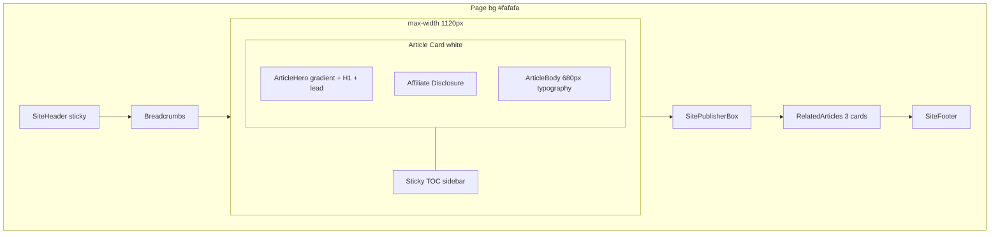
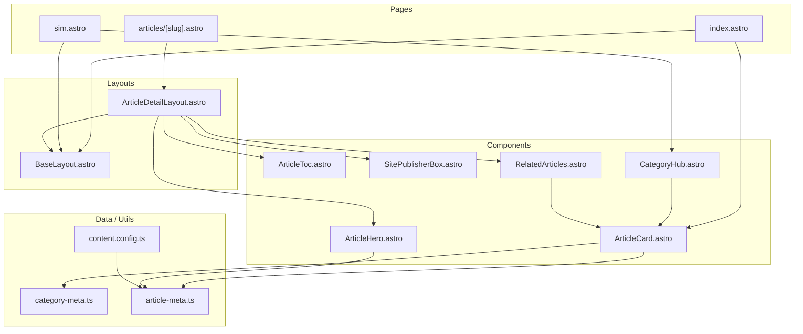

> **ドキュメント運用**: 今後の UI/UX 設計案・技術設計は本リポジトリの `docs/` ディレクトリに Markdown として保存する。ディレクトリが存在しない場合は作成すること。

# sim-hikari-guide.com Article UI v2 設計提案書

**対象**: `blog-affiliate-pipeline/site`（Astro 静的サイト / sim-hikari-guide.com）  
**現状**: 15 記事公開、Phase 1 P0 UX（パンくず・関連記事・表スクロール・アフィリエイト開示・日本語バッジ）済  
**目的**: 「白紙に文字」感を解消し、note.com / Qiita 相当の読み心地・一覧体験を実現する  
**ステータス**: 設計提案（未実装）  
**作成日**: 2026-07-19

---

## 0. 現状監査サマリー

### 本番 HTML（2026/7/19 時点）

| ページ | 現状 |
|--------|------|
| `/sim` | H1 + lead + **素の `<ul><li><a>` 11件**。サムネ・日付・抜粋なし |
| `/articles/sim-20gb-osusume/` | バッジ3つ + H1 + 開示 + **960px 全幅の本文**。ヒーロー・TOC・サイドバーなし |
| `/` | 3 カテゴリカードのみ。最新記事セクションなし |

### ソースで確認できた実装

- **レイアウト**: `BaseLayout.astro` — 単一 `.container`（`max-width: 960px`）、背景 `#ffffff`
- **記事**: `[slug].astro` — `<article>` 直置き、スタイルは表・blockquote・アフィリボタンのみ
- **一覧**: `sim.astro` / `hikari.astro` / `trouble.astro` — 同一パターンの `<ul>` リスト
- **トークン**: 6 変数のみ（`--text`, `--muted`, `--border`, `--accent`, `--bg`, `--surface`）
- **frontmatter**: `title`, `description`, `pubDate`, `category`, `articleType`, `keyword`, `draft` のみ

### note / Qiita と比較して **欠けているもの**

| 要素 | note | Qiita | 当サイト |
|------|------|-------|----------|
| 記事ヒーロー / カバー | ○ | △（グラデ背景） | ✗ |
| 本文 max-width 絞り込み | ○（~680px） | ○ | ✗（960px 全幅） |
| 目次（TOC） | ○ | ○（sticky） | ✗ |
| カード型一覧 | ○ | ○ | ✗ |
| サムネ / アイキャッチ | ○ | △ | ✗ |
| 著者 / 運営者ボックス | ○ | ○ | ✗ |
| タグ / カテゴリチップ | ○ | ○ | △（バッジのみ） |
| 読了時間 | △ | ○ | ✗ |
| 表のリッチスタイル | △ | ○ | △（枠線のみ） |
| 関連記事カード | ○ | ○ | △（テキストリンク） |
| OG 画像 | ○ | ○ | ✗（`summary` のみ） |
| ページ背景のレイヤー | ○（#fafafa 系） | ○ | ✗（真っ白） |

---

## 1. Requirements clarification（要件整理）

### 1.1 視覚的課題（ユーザー指摘の具体化）

| 画面 | 現状 | ユーザー体感 |
|------|------|-------------|
| **記事詳細** | 960px 幅の白背景に h1 → 本文がそのまま流れる | 「Word の印刷プレビュー」 |
| **カテゴリ一覧** (`/sim` 等) | `<ul><li><a>タイトル</a></li>` のみ | 「リンク集」 |
| **ホーム** | 3枚のテキストカードのみ、最新記事なし | 「ランディングページの下書き」 |
| **関連記事** | タイトル + 日付の縦リスト | 視覚的区切りが弱い |

**具体的に足りない要素**

- 記事ヘッダー（アイキャッチ / ヒーロー、リード文、読了時間）
- 本文用の**読みやすいタイポグラフィ**（行長・行間・見出し階層）
- **目次（TOC）** — note/Qiita 共通の定番
- 一覧の**カード型レイアウト**（サムネ・概要・メタ情報）
- 記事末尾の**著者/サイト情報ボックス**（信頼感）
- デスクトップでの**2カラム**（本文 + サイドバー）
- OGP 画像・JSON-LD（SNSシェア時の見た目）

**その他の課題**

- **ブランド感**: アクセント `#0b6bcb` とバッジ以外に視覚的アイデンティティがない
- **信頼 UI**: アフィリエイト開示はあるが、比較表・CTA が本文に埋もれ、編集メディア感が出ない

### 1.2 ターゲット体験の方向性

**推奨: note 系エディトリアル × Qiita 系構造化のハイブリッド（note 寄り 60% / Qiita 寄り 40%）**

| 観点 | 理由 |
|------|------|
| note 寄り | 一般消費者向け SIM/光回線ガイド。読みやすさ・余白・信頼感が CV に直結 |
| Qiita 寄り | 比較表・手順・FAQ など **構造化コンテンツ** が多い。TOC・表スタイル・メタ情報の明確化を借用 |
| note 純粋模倣は避ける | いいね/フォロー/著者プロフィール演出は不要。アフィリエイト媒体として虚偽著者を作らない |
| Qiita 純粋模倣は避ける | エンジニア向けダークモード・コードハイライトは本ニッチに過剰 |

**キーワード**: 「読みやすい比較メディア」「公式確認を促す中立ガイド」

---

## 2. Component design（コンポーネント設計）

### 2.1 Design Tokens（`src/styles/tokens.css` 新設推奨）

```css
/* カラー */
--bg-page:        #fafafa;      /* ページ背景（note 的な off-white） */
--bg-article:     #ffffff;      /* 記事カード / 本文エリア */
--bg-hero:        linear-gradient(135deg, #f0f6ff 0%, #fafafa 100%);
--text-primary:   #1a1a1a;
--text-secondary: #5c5c5c;
--text-tertiary:  #8a8a8a;
--accent:         #0b6bcb;      /* 既存維持 */
--accent-soft:    #e8f2ff;
--border:         #e8e8e8;
--border-strong:  #d0d0d0;
--shadow-sm:      0 1px 3px rgba(0,0,0,.06);
--shadow-md:      0 4px 12px rgba(0,0,0,.08);
--radius-sm:      6px;
--radius-md:      12px;
--radius-lg:      16px;

/* カテゴリ色（サムネ placeholder 用） */
--color-sim:      #0b6bcb;
--color-hikari:   #059669;
--color-trouble:  #d97706;

/* タイポグラフィ */
--font-sans:  "Noto Sans JP", "Hiragino Sans", sans-serif;
--font-serif: "Noto Serif JP", "Hiragino Mincho ProN", serif; /* H1 のみ */
--text-body:    1.0625rem;   /* 17px */
--text-lead:    1.125rem;    /* 18px */
--line-body:    1.85;
--line-heading: 1.4;

/* レイアウト */
--width-page:    1120px;      /* 外枠（サイドバー込み） */
--width-body:    680px;       /* 本文カラム（note 相当） */
--width-sidebar: 240px;
--space-section: 3rem;
--space-block:   1.5rem;
```

**ページ構造の変更**

- `body { background: var(--bg-page); }`
- 記事エリア: 白カード `background: var(--bg-article); border-radius: var(--radius-md); box-shadow: var(--shadow-sm); padding: 2rem 2.5rem;`
- `main.container` → 一覧は `max-width: 1100px`、記事は `max-width: 1120px`（2カラム用）

---

### 2.2 `ArticleDetailLayout.astro`（新規レイアウト）

`[slug].astro` から分離。2 カラム（desktop）+ 1 カラム（mobile）。

#### 構成ブロック

```
┌─────────────────────────────────────────────────┐
│ Breadcrumbs                                      │
├─────────────────────────────────────────────────┤
│ ArticleHero                                      │
│  - category chip + type chip + date + read time  │
│  - H1 (serif, 2rem~2.5rem)                       │
│  - lead excerpt (description)                    │
│  - optional eyecatch (16:9, max-height 280px)    │
├─────────────────────────────────────────────────┤
│ AffiliateDisclosure (既存)                         │
├──────────────────┬──────────────────────────────┤
│ ArticleSidebar   │ ArticleBody                   │
│ (sticky TOC)     │  - prose typography           │
│  desktop only    │  - tables, lists, blockquote  │
│                  │  - AffiliateCtaBlock (inline) │
├──────────────────┴──────────────────────────────┤
│ SitePublisherBox (運営者情報リンク、著者フェイクなし) │
├─────────────────────────────────────────────────┤
│ RelatedArticles (カード化)                         │
└─────────────────────────────────────────────────┘
```

#### Props

```typescript
type ArticleDetailLayoutProps = {
  entry: CollectionEntry<"articles">;
  breadcrumbs: BreadcrumbItem[];
  showAffiliateDisclosure: boolean;
  readingTimeMinutes: number;
  toc: TocItem[];           // h2/h3 から生成
  relatedArticles: CollectionEntry<"articles">[];
};
```

#### State

- 静的サイトのため **クライアント state なし**
- TOC の sticky は CSS `position: sticky; top: 5rem;` のみ
- モバイル TOC は `<details>` アコーディオン（折りたたみ目次）

#### CSS 要点

| 要素 | 指定 |
|------|------|
| 外枠 | `max-width: 1120px; margin: 0 auto; padding: 0 1rem` |
| 本文 | `max-width: 680px; font-size: 17px; line-height: 1.85` |
| H2 | `font-size: 1.375rem; margin-top: 3rem; padding-bottom: 0.5rem; border-bottom: 2px solid var(--accent-soft)` |
| H3 | `font-size: 1.125rem; margin-top: 2rem; color: var(--text-primary)` |
| 段落 | `margin-bottom: 1.25rem` |
| リスト | `padding-left: 1.25rem; li { margin-bottom: 0.5rem }` |
| blockquote | 既存 + `background: #f8fafc; padding: 1rem 1.25rem; border-radius: var(--radius-sm)` |
| 表 thead | `background: var(--accent-soft); font-weight: 600` |
| 表 zebra | `tbody tr:nth-child(even) { background: #fafafa }` |
| 表 hover | `tbody tr:hover { background: #f0f6ff }` |

---

### 2.3 `ArticleHero.astro`（新規）

- **背景**: `var(--bg-hero)` 全幅帯（Qiita 的 subtle gradient、高さ auto）
- **H1**: `font-family: var(--font-serif); font-weight: 700; letter-spacing: 0.02em`
- **メタバー**: chip 横並び + `·` 区切りで date / 読了時間（例: `2026/7/17 · 約8分`）
- **lead**: `entry.data.description` を hero 内に表示（現状 meta description のみ → 視覚化）
- **Eyecatch**: optional。未設定時はグラデーション帯のみ

#### Props

```typescript
type ArticleHeroProps = {
  title: string;
  description: string;
  category: CategorySlug;
  articleType: ArticleType;
  pubDate: Date;
  readingTimeMinutes: number;
  eyecatch?: string;
};
```

---

### 2.4 `ArticleToc.astro` / `TableOfContents.astro`（新規）

- h2/h3 からビルド時に生成
- Desktop: 左または右サイドバーに sticky（`top: 5rem`）
- Mobile: 本文直上に `<details>` 折りたたみ
- `<nav aria-label="目次">`、見出し id とアンカー連携

```typescript
type TocItem = {
  id: string;
  text: string;
  level: 2 | 3;
};
```

---

### 2.5 `ArticleCard.astro`（新規）

一覧・関連記事・ホームで共用。

#### 見た目

```
┌──────────────────────────────┐
│ [thumbnail 16:9]             │  ← 画像 or カテゴリアイコン placeholder
│  ┌ 格安SIM ┐  ┌ 比較 ┐       │  ← chips
│  タイトル（2行 clamp）         │
│  説明文 excerpt（2行 clamp）  │
│  2026/7/17 · 約8分            │
└──────────────────────────────┘
  hover: shadow-md + translateY(-2px)
```

#### Props

```typescript
type ArticleCardProps = {
  slug: string;
  title: string;
  description: string;
  pubDate: Date;
  category: CategorySlug;
  articleType: ArticleType;
  readingTimeMinutes?: number;
  eyecatch?: string;          // optional URL
  variant?: "grid" | "compact" | "horizontal"; // 関連記事は compact/horizontal
};
```

#### CSS

- カード: `background: #fff; border: 1px solid var(--border); border-radius: 12px; overflow: hidden; transition: box-shadow .2s, transform .2s`
- hover: `box-shadow: var(--shadow-md); transform: translateY(-2px); text-decoration: none`
- サムネ placeholder: カテゴリ別グラデーション（sim=青、hikari=緑、trouble=橙）+ 中央に SVG アイコン
- グリッド: `grid-template-columns: repeat(2, 1fr); gap: 1.25rem`（tablet 以上）、mobile は 1 列

**サムネイル戦略（画像なしでも成立）**

- カテゴリ色グラデーション + アイコン（SIM/光/困り）の **CSS 生成サムネ**
- 将来 `eyecatch` frontmatter があれば `` に差し替え
- 外部ストック写真は使わない（著作権・一貫性のため）

---

### 2.6 `CategoryHub.astro`（`/sim` 等リデザイン）

`sim.astro` / `hikari.astro` / `trouble.astro` を共通コンポーネントに集約。

#### 構成

```
┌─────────────────────────────────────────┐
│ Breadcrumbs                              │
│ CategoryHero                             │
│  - H1 + category description (拡張 meta) │
│  - 記事数バッジ「全11件」                  │
├─────────────────────────────────────────┤
│ Filter chips（任意 P1）                  │
│  [すべて] [比較] [手順] [トラブル]        │
├─────────────────────────────────────────┤
│ ArticleCardGrid (2列 tablet / 3列 PC)  │
│  - pubDate 降順                           │
├─────────────────────────────────────────┤
│ CategoryGuideBox (optional P2)           │
│  - 「格安SIMの選び方」固定 3 行テキスト    │
└─────────────────────────────────────────┘
```

#### Props

```typescript
type CategoryHubProps = {
  category: CategorySlug;
  articles: CollectionEntry<"articles">[];
};
```

---

### 2.7 Home page refresh（`index.astro`）

#### 追加セクション

1. **Hero**（既存 H1 強化）— 背景グラデーション帯、リード文 2 行
2. **最新記事** — `ArticleCard` × 6（全カテゴリ、`pubDate` 降順）
3. **カテゴリ入口** — 既存 3 カードを視覚強化（アイコン + 記事数 + hover）
4. **Trust strip** — 「公式情報を参照した中立ガイド」「アフィリエイト開示」1 行

#### レイアウト

- Hero: 全幅グラデ、`padding: 3rem 0`
- 最新記事: `h2` + 2 列グリッド
- カテゴリ: 3 列（既存 grid 維持、カードに `min-height: 180px` + CTA ボタンスタイル）

---

### 2.8 その他コンポーネント

#### `AffiliateCtaBlock`（新規、P1/P2）

- インライン `.affiliate-link` を **カード型 CTA** に昇格（オプション）
- 構成: キャリア名 + 1 行説明 + 「公式サイトで確認」ボタン + `rel="sponsored"` 維持
- 背景 `#f0f6ff`、左ボーダー 4px accent

#### `SitePublisherBox.astro` / `AuthorBox.astro`（著者ボックス代替）

- **虚偽著者は作らない**。`/about` へのリンク付き運営者情報
- 文言例: 「SIM・光回線ガイド編集部（運営者情報）｜料金は各公式サイトでご確認ください」
- アイコン: サイト favicon または neutral SVG（人物写真なし）

#### `BaseLayout` / `SiteHeader` / `SiteFooter` 改修

| 変更 | 内容 |
|------|------|
| Header | 高さ固定 `64px`、`position: sticky; top: 0; z-index: 100; backdrop-filter: blur(8px)` |
| Nav active | 現在カテゴリに下線 or 背景ハイライト |
| Main | 記事ページのみ `class="layout-article"` で幅 1120px、それ以外 960px |
| Footer | 2 カラム（desktop）: 左=リード、右=ナビリンク |

---

## 3. Data design（データ設計）

### 3.1 frontmatter 拡張（`content.config.ts`）

```typescript
// すべて optional（既存 15 記事は未設定でも動作）
eyecatch: z.string().optional(),        // "/images/eyecatch/sim-20gb.webp"
excerpt: z.string().max(160).optional(), // 未設定時は description を流用
readingTime: z.number().optional(),     // 未設定時は自動計算
updatedDate: z.coerce.date().optional(),
featured: z.boolean().default(false),   // ホーム注目（P2）
```

**既存 15 記事は変更不要** — `description` を excerpt として流用。

### 3.2 自動派生ユーティリティ（`src/utils/article-meta.ts`）

```typescript
// readingTime: body 文字数 / 400（日本語目安）→ 切り上げ
// excerpt: excerpt ?? description
// eyecatchUrl: eyecatch ?? getCategoryPlaceholder(category)
// toc: remark/rehype で h2/h3 抽出 → { id, text, level }[]
```

| 派生値 | 算出方法 |
|--------|----------|
| `readingMinutes` | 本文文字数 ÷ 400（日本語目安） |
| `headings[]` | rehype プラグインで h2/h3 の id + text を抽出 |
| `eyecatchFallback` | category → グラデーション CSS class |

### 3.3 `category-meta.ts` 拡張

```typescript
type CategoryMeta = {
  label: string;
  href: string;
  description: string;        // 既存
  heroLead: string;           // 新規: カテゴリページ lead 文
  icon: string;               // SVG パス or emoji key
  themeColor: string;         // placeholder グラデ用 "#0b6bcb"
  gradient: string;           // "linear-gradient(135deg, #e8f2ff, #dbeafe)"
  articleCount?: number;      // ビルド時算出
};
```

### 3.4 OG / SEO 拡張（P1）

- `og:type: article`（記事ページ）
- `og:image` — カテゴリ placeholder 画像 or eyecatch（1200×630 静的生成は P2）
- `article:published_time`
- JSON-LD: `Article` + `BreadcrumbList` + `WebSite`

---

## 4. Concerns（懸念事項）

| 領域 | 懸念 | 対策 |
|------|------|------|
| **Performance** | Noto Serif JP 追加で FOIT/FOUT | `font-display: swap`、H1 のみ serif、subset woff2 |
| **Performance** | カード hover transform | `will-change` 乱用せず、GPU 負荷は軽微 |
| **Performance** | 外部フォント | CSS サムネのみ、JS は TOC の `<details>` 程度 |
| **a11y** | カード全体がリンク | `<a>` に `aria-label="{title} の記事を読む"`、chip は span |
| **a11y** | TOC | `<nav aria-label="目次">`、見出し id と連携 |
| **a11y** | 色コントラスト | accent on white は WCAG AA 確認（#0b6bcb は OK） |
| **Affiliate コンプライアンス** | CTA カード化で宣伝色が強くなる | 開示を hero 直下に維持、sponsored 属性維持、CTA 文言は「公式で確認」 |
| **著者表示** | note 的著者ヘッダーの誘惑 | **SitePublisherBox のみ**。個人名・顔写真・架空編集者は作らない |
| **Mobile** | 2 列グリッド | `<768px` で 1 列、TOC は折りたたみ、表スクロールは既存維持 |
| **Mobile** | sticky TOC | モバイルでは sticky を使わず `<details>` で折りたたみ |
| **コンテンツ負債** | eyecatch 未整備 | カテゴリ placeholder で統一、後から差し替え可能に |
| **ビルド** | TOC 生成 | ビルド時静的。JS 不要（Astro 純 CSS） |
| **長いタイトル** | カード崩れ | `-webkit-line-clamp: 2` |
| **記事量増加** | 一覧の filter | カテゴリ filter は P1。P0 は sort by pubDate のみ |

---

## 5. Priority & Effort（優先度）

### P0 — 一覧・記事の「白紙感」解消（目安 **2–3 日**）

| # | 項目 | 内容 |
|---|------|------|
| P0-1 | Design tokens + ページ背景 | `tokens.css`、`body bg #fafafa` |
| P0-2 | `ArticleCard` + CategoryHub グリッド | `/sim` `/hikari` `/trouble` を 2 列カード化 |
| P0-3 | `ArticleHero` + 本文 typography | 680px 本文、H1 serif、H2 下線、段落リズム |
| P0-4 | 記事白カード化 | padding + shadow + radius |
| P0-5 | `readingTime` 自動計算 | frontmatter optional、表示のみ |
| P0-6 | 関連記事カード化 | `RelatedArticles` → `ArticleCard variant="compact"` × 3 |
| P0-7 | 表スタイル強化 | thead 背景、zebra、角丸 wrapper |

### P1 — 構造化・信頼 UI（目安 **2 日**）

| # | 項目 | 内容 |
|---|------|------|
| P1-1 | TOC（desktop sticky + mobile accordion） | remark プラグイン or ビルド時パース |
| P1-2 | `SitePublisherBox` | /about リンク、AI 注記統一 |
| P1-3 | Home 最新記事セクション | ArticleCard × 6 |
| P1-4 | Header sticky + nav active | |
| P1-5 | OG `article` + placeholder og:image | カテゴリ別 1 枚 |
| P1-6 | JSON-LD（Article, BreadcrumbList） | |
| P1-7 | CategoryHero band + 記事数表示 | |
| P1-8 | `SiteHeader` / `SiteFooter` 分離・強化 | |

### P2 — 仕上げ・拡張（目安 **2–3 日**）

| # | 項目 | 内容 |
|---|------|------|
| P2-1 | eyecatch 画像パイプライン | frontmatter + `/public/images/eyecatch/` |
| P2-2 | `AffiliateCtaBlock` カード化 | rehype または Markdown コンポーネント |
| P2-3 | CategoryGuideBox | カテゴリ固定ガイド文 |
| P2-4 | 結論サマリ Callout | 先頭 H2 を `.callout-summary` で囲む rehype |
| P2-5 | 動的 OG 画像生成 | `@vercel/og` or satori（Vercel デプロイ時） |
| P2-6 | Noto Serif JP self-host | Google Fonts or npm package |
| P2-7 | カテゴリ filter chips | 比較/手順/トラブル |
| P2-8 | ダークモード | 需要があれば |

---

## 6. Wireframes（ワイヤーフレーム）

### 6.1 記事ページ（desktop · ASCII）

```
┌──────────────────────────────────────────────────────────────────┐
│ [Logo]              格安SIM | 光回線 | お困り系          (sticky) │
├──────────────────────────────────────────────────────────────────┤
│  ホーム › 格安SIM › 記事タイトル                                     │
│                                                                    │
│  ╔══════════════════════════════════════════════════════════════╗  │
│  ║ ░░░ gradient hero ░░░░░░░░░░░░░░░░░░░░░░░░░░░░░░░░░░░░░░░░░ ║  │
│  ║  [格安SIM] [比較]  2026/7/17 · 約8分                           ║  │
│  ║  格安SIM 20GBの選び方と比較ポイント【2026年7月版】  ← serif H1  ║  │
│  ║  公式情報を参照しながら中立に解説…          ← lead              ║  │
│  ╚══════════════════════════════════════════════════════════════╝  │
│  ┌─ アフィリエイト開示 ─────────────────────────────────────────┐  │
│  │ 当記事にはアフィリエイトリンクが…                              │  │
│  └──────────────────────────────────────────────────────────────┘  │
│                                                                    │
│  ┌─────────┐  ┌──────────────────────────────────────────────┐   │
│  │ 目次     │  │  ## 結論サマリ                                │   │
│  │ (sticky) │  │  本文テキスト…（max-width 680px）              │   │
│  │ · 結論   │  │                                               │   │
│  │ · 比較   │  │  ## 料金・プラン比較表                         │   │
│  │ · 向き人 │  │  ┌────────────────────────────┐              │   │
│  │ · FAQ    │  │  │ thead (accent-soft bg)      │              │   │
│  │          │  │  │ 楽天 | LINEMO | …           │              │   │
│  └─────────┘  │  └────────────────────────────┘              │   │
│               │  [楽天モバイルの公式を見る] ← CTA button        │   │
│               └──────────────────────────────────────────────┘   │
│  ┌─ 運営者情報 ────────────────────────────────────────────────┐  │
│  │ SIM・光回線ガイド │ 運営者情報を見る →                        │  │
│  └──────────────────────────────────────────────────────────────┘  │
│  ## 関連記事                                                        │
│  ┌────────┐ ┌────────┐ ┌────────┐                                  │
│  │ Card 1 │ │ Card 2 │ │ Card 3 │                                  │
│  └────────┘ └────────┘ └────────┘                                  │
└──────────────────────────────────────────────────────────────────┘
```

### 6.2 カテゴリ一覧 `/sim`（desktop · ASCII）

```
┌────────────────────────────────────────────┐
│ ホーム › 格安SIM                            │
│                                            │
│ ╔════════════════════════════════════════╗ │
│ ║ 格安SIM                    [全11件]    ║ │
│ ║ 乗り換え・MNP・料金比較…               ║ │
│ ╚════════════════════════════════════════╝ │
│                                            │
│ ┌─────────────┐  ┌─────────────┐          │
│ │ [thumb]     │  │ [thumb]     │          │
│ │ chips       │  │ chips       │          │
│ │ タイトル     │  │ タイトル     │          │
│ │ 説明…       │  │ 説明…       │          │
│ │ 7/19 · 8分  │  │ 7/17 · 6分  │          │
│ └─────────────┘  └─────────────┘          │
│ ┌─────────────┐  ┌─────────────┐          │
│ │   …         │  │   …         │          │
│ └─────────────┘  └─────────────┘          │
└────────────────────────────────────────────┘
```

### 6.3 記事詳細ページ構成（mermaid）



### 6.4 コンポーネント依存（mermaid）



---

## 7. 実装ファイル構成（参考）

```text
site/src/
├── styles/
│   ├── tokens.css          # 新規
│   └── prose.css           # 記事本文 typography
├── layouts/
│   ├── BaseLayout.astro    # 改修
│   ├── ArticleDetailLayout.astro  # 新規
│   └── CategoryHubLayout.astro    # 新規（任意）
├── components/
│   ├── ArticleCard.astro   # 新規
│   ├── ArticleHero.astro   # 新規
│   ├── ArticleToc.astro    # 新規
│   ├── ArticleBody.astro   # 新規（typography ラッパー）
│   ├── CategoryHub.astro   # 新規
│   ├── SitePublisherBox.astro  # 新規
│   ├── SiteHeader.astro    # 新規（BaseLayout から分離）
│   ├── SiteFooter.astro    # 新規
│   └── RelatedArticles.astro   # 改修
├── plugins/
│   └── rehype-headings.ts  # TOC 用 id 付与
├── utils/
│   └── article-meta.ts     # 新規（readingTime, excerpt, toc）
└── pages/
    ├── index.astro         # 改修
    ├── sim.astro           # CategoryHub 利用に簡素化
    ├── hikari.astro
    ├── trouble.astro
    └── articles/[slug].astro  # ArticleDetailLayout 利用
```

---

## 8. Before / After イメージ

**Before（現状）**

- 記事: 白背景に h1 → テキストが 960px 幅で流れる
- 一覧: 11行の `<ul>` リンク
- ホーム: カテゴリ 3 枚のみ

**After（P0 完了時）**

- 記事: グレー背景上の白カード、グラデーション Hero、680px の読みやすい本文、表が見やすい、末尾にカード型関連記事
- 一覧: 2 列のカードグリッド（サムネ・概要・日付・読了時間）
- ホーム: 最新記事セクション（P1）

**After（P1 完了時）**

- 記事: sticky TOC、運営者ボックス、OG/JSON-LD
- ホーム: 最新 6 記事カード、強化された Header/Footer

---

## 9. Open questions（未決事項）

実装前に方針確認が必要な項目。

### Q1. サムネイル: CSS グラデーション vs OG 画像テンプレート

| 選択肢 | メリット | デメリット |
|--------|----------|------------|
| **A. P0 は CSS グラデーション + アイコンのみ**（推奨） | 実装が早い、著作権リスクなし、一貫性 | SNS シェア時の OG は別途 P1/P2 で対応 |
| **B. P0 から OG 画像テンプレートも用意** | SNS 見た目が早く改善 | 工数増、デプロイ環境依存（satori 等） |

**暫定推奨**: A（CSS placeholder）→ P1 でカテゴリ別静的 OG 1 枚 → P2 で動的生成

### Q2. TOC: sticky サイドバー vs 折りたたみ配置

| デバイス | 推奨方針 |
|----------|----------|
| Desktop（≥1024px） | 左または右サイドバーに **sticky TOC**（`top: 5rem`） |
| Tablet（768–1023px） | 本文直上に `<details>` 折りたたみ（sticky なし） |
| Mobile（<768px） | 本文直上に `<details open>` 折りたたみ |

**確認事項**: Desktop で TOC を左サイドバー vs 右サイドバーのどちらに置くか（Qiita は左、note は目次なし or 上部が多い）。**暫定推奨**: 左サイドバー（本文右寄せで note 的な読み幅を確保）。

---

## 10. 承認ゲート

上記設計（**P0: カード一覧 + 記事 typography/hero、P1: TOC + 表 + ホーム刷新、P2: eyecatch/CTA カード**）で問題なければ、次のメッセージで以下を送る。

> **I agree with the design. Please start implementation.**

実装時は `feature/article-ui-v2` ブランチで進め、ESLint / Prettier / ビルド確認後に PR を作成する。
