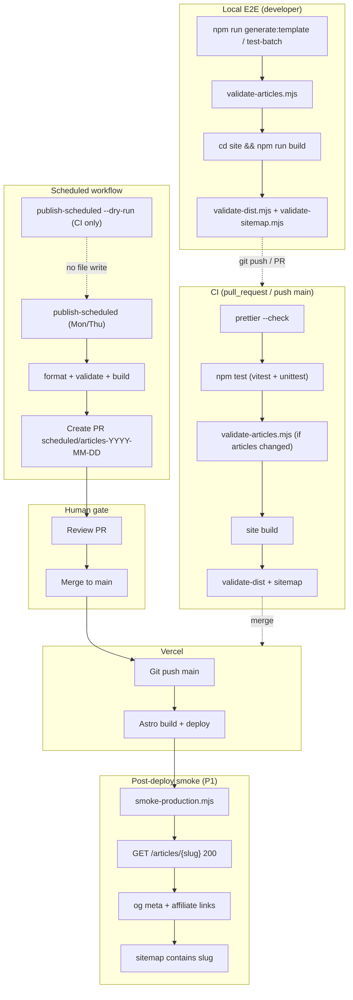

# Markdown Git 公開 E2E チェック設計

**対象**: `blog-affiliate-pipeline`（格安 SIM × 光回線アフィリエイト / sim-hikari-guide.com）  
**ロードマップ**: Markdown Git 公開 E2E（W4）— draft → `site/content` → PR → merge → Vercel  
**ステータス**: 設計提案（未実装）  
**作成日**: 2026-07-19

---

## 現状サマリー（コードベース調査）

| 領域       | 現状                                                                              |
| ---------- | --------------------------------------------------------------------------------- |
| 記事生成   | `packages/generator`（Python）— template / Groq、`publish_schedule.py` で定期公開 |
| 出力先     | `site/src/content/articles/*.md`                                                  |
| サイト     | Astro 5 + `@astrojs/sitemap`、`site: https://sim-hikari-guide.com`                |
| 単体テスト | Vitest（`packages/publisher`）、Python unittest（`packages/generator/tests`）     |
| CI         | `.github/workflows/ci.yml` — format / test / generator test / site build          |
| 定期 WF    | `.github/workflows/scheduled-articles.yml` — 生成 → validate → PR                 |
| Playwright | **未導入**（兄弟リポ `article-auto-post` のみ X 投稿自動化で使用）                |
| SEO slug   | `assert_seo_slug()` が `article-p{N}` 形式を拒否                                  |
| dry-run    | `run_publish_scheduled(..., dry_run=True)` 実装済み                               |

---

### 1. Requirements clarification（要件整理）

#### 1.1 検証対象フロー

```
keywords.seed.csv / batch JSON
  → generator (template|groq)
  → site/src/content/articles/{slug}.md
  → astro build → dist/
  → git commit → PR → CI green → merge main
  → Vercel deploy → https://sim-hikari-guide.com/articles/{slug}
```

#### 1.2 E2E チェックが検証すべきこと

| レイヤ                         | 検証内容                                                  | 成功条件                                                         |
| ------------------------------ | --------------------------------------------------------- | ---------------------------------------------------------------- |
| **Local（開発者 / pre-push）** | 記事生成 → ファイル存在 → Astro ビルド → slug SEO 妥当性  | 生成 MD が schema 準拠、ビルド成功、`article-p\d+` 不在          |
| **CI（PR / push to main）**    | format / test / build                                     | 既存 `ci.yml` と同等以上。記事 diff がある PR は site build 必須 |
| **Post-deploy（本番反映後）**  | 本番 URL 200、sitemap 掲載、OG meta、アフィリエイトリンク | HTTP 200、`<meta property="og:*">` 存在、比較記事に A8/VC リンク |
| **Scheduled workflow dry-run** | 定期 WF が誤生成しないこと                                | `--dry-run` で keywords のみ返却、queue 未更新、ファイル未生成   |

#### 1.3 スコープ外（本設計では E2E に含めない）

- Groq 生成品質の LLM 評価（別途 quality gate の単体テストで担保）
- 料金数値の正確性（人手レビュー＋将来 scraper）
- WordPress 投稿パス（`packages/publisher` の WP 連携は Markdown Git 公開の E2E 外）
- ブラウザでの視覚的回帰（P2 候補）

#### 1.4 未確定事項（実装前に確認）

1. Post-deploy チェックのトリガー: Vercel Deploy Hook / `repository_dispatch` / 定期 cron のどれを採用するか
2. 本番 smoke の対象 slug: 固定 fixture 1 本 vs 直近マージ PR から動的取得
3. `GROQ_API_KEY` 有無での CI 分岐（template 固定 vs optional integration）

---

### 2. Component design（コンポーネント設計）

#### 2.1 推奨ツール選定

| 方式                                               | 適合度                     | 理由                                                                                 |
| -------------------------------------------------- | -------------------------- | ------------------------------------------------------------------------------------ |
| **Vitest + Python unittest + Node 検証スクリプト** | ★★★ 推奨（P0）             | 既存慣習と一致。`dist/` HTML / sitemap XML を Node で解析可能。CI 追加コスト最小     |
| **gh + curl + 軽量 Node パーサ**                   | ★★☆ 推奨（P1 post-deploy） | 本番 URL の HTTP / meta 確認に十分。Playwright 不要                                  |
| **Playwright**                                     | ★☆☆ P2 のみ                | 静的 Astro サイトでは過剰。JS 実行不要のチェックが大半。兄弟リポはブラウザ自動化用途 |

**結論**: P0/P1 は **Vitest + unittest + カスタム Node スクリプト + gh/curl**。Playwright は P2（任意の smoke browser テスト）に留める。

#### 2.2 新規モジュール構成（提案）

```
blog-affiliate-pipeline/
├── scripts/e2e/
│   ├── validate-articles.mjs      # MD frontmatter / slug / affiliate パターン
│   ├── validate-dist.mjs          # dist HTML: og, canonical, json-ld
│   ├── validate-sitemap.mjs       # sitemap-*.xml に slug 存在
│   ├── smoke-production.mjs       # 本番 URL チェック（curl fetch + cheerio）
│   └── run-local-e2e.sh           # ローカル一括: generate → validate → build → validate-dist
├── packages/generator/tests/
│   └── test_e2e_publish.py        # 生成→ファイル→quality→slug の統合（temp dir）
├── site/tests/                    # 新設（任意）
│   └── build-output.test.mjs      # vitest で dist 検証を CI から呼ぶ
└── .github/workflows/
    ├── ci.yml                     # 拡張: article diff 時 validate-articles
    ├── scheduled-articles.yml     # 拡張: dry-run ジョブ追加
    └── post-deploy-smoke.yml      # 新規: main push / workflow_dispatch
```

#### 2.3 スクリプト責務

| モジュール              | 入力                                   | 検証                                                                               | 実行タイミング        |
| ----------------------- | -------------------------------------- | ---------------------------------------------------------------------------------- | --------------------- |
| `validate-articles.mjs` | `site/src/content/articles/*.md`       | frontmatter 必須項目、`draft: false`、slug 正規表現、禁止 slug、affiliate URL 形式 | CI / local            |
| `validate-dist.mjs`     | `site/dist/articles/{slug}/index.html` | `<title>`, `og:title`, `og:image`, `og:url`, Article JSON-LD                       | CI（build 後）/ local |
| `validate-sitemap.mjs`  | `site/dist/sitemap*.xml`               | 全公開 slug が `<loc>` に含まれる                                                  | CI / post-deploy      |
| `smoke-production.mjs`  | `E2E_SMOKE_SLUGS` env                  | `GET /articles/{slug}` → 200、meta、affiliate href                                 | post-deploy           |
| `run-local-e2e.sh`      | `--mode template`                      | 上記を順次実行、exit code 集約                                                     | 開発者手動            |
| `test_e2e_publish.py`   | temp workspace + fixture seed          | `generate_one` → ファイル → `check_article` → `assert_seo_slug`                    | `npm test`            |

#### 2.4 GitHub Actions ジョブ設計

**A. `ci.yml` 拡張（P0）**

```yaml
# PR で site/src/content/articles/** が変わった場合のみ追加
- name: Validate article markdown
  if: ...paths filter...
  run: node scripts/e2e/validate-articles.mjs

- name: Validate build output
  working-directory: site
  run: |
    npm run build
    node ../scripts/e2e/validate-dist.mjs
    node ../scripts/e2e/validate-sitemap.mjs
```

**B. `scheduled-articles-dry-run.yml` または scheduled 内ステップ（P0）**

```yaml
- name: Dry-run scheduled publish
  run: |
    PYTHONPATH=packages/generator python3 -m generator publish-scheduled --dry-run --force
  # 期待: exit 0, keywords 出力, git diff なし（queue / articles 未変更）
```

**C. `post-deploy-smoke.yml`（P1）**

| トリガ | `workflow_dispatch` + `push` to `main`（paths: `site/**`）                            |
| ------ | ------------------------------------------------------------------------------------- |
| env    | `PRODUCTION_URL=https://sim-hikari-guide.com`, `E2E_SMOKE_SLUGS=sim-20gb-osusume,...` |
| steps  | checkout → `node scripts/e2e/smoke-production.mjs`                                    |
| 失敗時 | GitHub Actions summary + optional issue comment                                       |

**D. 既存 auto-merge ワークフロー**

- 設計書 PR: `docs/**` only → `design-docs-auto-merge.yml`
- 記事公開 PR: `article-publish` ラベル / `scheduled/articles-*` → `articles-auto-merge.yml`

#### 2.5 npm scripts（提案）

```json
{
  "test:e2e:local": "bash scripts/e2e/run-local-e2e.sh --mode template",
  "test:e2e:articles": "node scripts/e2e/validate-articles.mjs",
  "test:e2e:dist": "node scripts/e2e/validate-dist.mjs && node scripts/e2e/validate-sitemap.mjs",
  "test:e2e:smoke": "node scripts/e2e/smoke-production.mjs"
}
```

---

### 3. Data design（データ設計）

#### 3.1 設定ファイル

| ファイル                         | 用途                                              |
| -------------------------------- | ------------------------------------------------- |
| `config/e2e-smoke.json`          | 本番 smoke 対象 slug、期待 status、必須 meta キー |
| `config/test-batch.json`         | ローカル E2E 用固定 5 KW（既存・審査用）          |
| `config/publish-schedule.json`   | 定期公開設定（既存）                              |
| `config/quality-thresholds.json` | 品質ゲート閾値（既存）                            |
| `data/keywords.seed.csv`         | 定期キュー seed（既存）                           |

**`config/e2e-smoke.json` 案**

```json
{
  "productionUrl": "https://sim-hikari-guide.com",
  "smokeSlugs": ["sim-20gb-osusume", "hikari-mansion-osusume"],
  "requiredOgTags": ["og:title", "og:description", "og:image", "og:url"],
  "affiliatePatterns": ["px\\.a8\\.net", "valuecommerce\\.com"],
  "articlesRequiringAffiliate": ["sim-20gb-osusume"]
}
```

#### 3.2 Fixture / テストデータ

| Fixture                                               | 内容                                                      |
| ----------------------------------------------------- | --------------------------------------------------------- |
| `packages/generator/tests/fixtures/e2e-mini-seed.csv` | 1 KW のみ（template 生成用）                              |
| `packages/generator/tests/fixtures/e2e-schedule.json` | `articles_per_run: 1`, `generation_mode: template`        |
| temp dir 記事                                         | 各テストで `TemporaryDirectory`、リポジトリ本体を汚さない |

#### 3.3 状態・出力

| パス                        | E2E での扱い                               |
| --------------------------- | ------------------------------------------ |
| `state/publish-queue.json`  | dry-run では**変更しない**ことを assert    |
| `state/generate-state.json` | ローカル E2E では gitignore または reset   |
| `site/dist/`                | build 後検証の入力。CI artifact 化（任意） |

#### 3.4 Secrets / env

| 変数              | 用途                       | 必須           |
| ----------------- | -------------------------- | -------------- |
| `GROQ_API_KEY`    | Groq 生成（scheduled WF）  | 定期生成時のみ |
| `PRODUCTION_URL`  | smoke ベース URL           | post-deploy    |
| `E2E_SMOKE_SLUGS` | カンマ区切り slug override | optional       |
| `GITHUB_TOKEN`    | gh pr / workflow           | CI 標準        |

---

### 4. Concerns（懸念事項）

| 懸念                           | 影響                      | 対策                                                                          |
| ------------------------------ | ------------------------- | ----------------------------------------------------------------------------- |
| **Flaky 本番 smoke**           | Vercel CDN 反映遅延で 404 | merge 後 2–5 分 retry（exponential backoff、最大 5 回）                       |
| **Groq API レート / 障害**     | scheduled WF 失敗         | CI E2E は template 固定。Groq は optional nightly                             |
| **slug 衝突**                  | ビルド失敗                | 生成前 `get_published_slugs` + `assert_seo_slug`（既存）を E2E でも検証       |
| **secrets 混入 PR**            | セキュリティ              | validate-articles で API key パターン grep（任意 P1）                         |
| **CI 時間増**                  | PR フィードバック遅延     | paths filter で記事変更時のみ dist 検証                                       |
| **sitemap 遅延**               | 新記事が sitemap に未反映 | dist 検証は build 直後。sitemap は Astro integration が全 static path を出力  |
| **アフィリエイトリンク欠落**   | ASP 審査リスク            | 比較記事 category=sim/hikari で `hasAffiliateLinks` 相当を MD レベルで assert |
| **scheduled dry-run と force** | queue 誤更新              | dry-run 時は `save_queue_state` 未呼び出しを unittest で固定                  |

---

### 5. P0 / P1 / P2 優先度

| 優先度 | 項目                                    | 成果物                                           | 目安     |
| ------ | --------------------------------------- | ------------------------------------------------ | -------- |
| **P0** | 記事 MD 検証スクリプト                  | `scripts/e2e/validate-articles.mjs`              | 1h       |
| **P0** | CI build 後 dist / sitemap 検証         | `ci.yml` 拡張 + `validate-dist.mjs`              | 1h       |
| **P0** | Python 統合テスト（生成→ファイル→slug） | `test_e2e_publish.py`                            | 1h       |
| **P0** | scheduled dry-run CI ステップ           | `scheduled-articles.yml` or 新 workflow          | 30m      |
| **P0** | ローカル一括 `npm run test:e2e:local`   | `run-local-e2e.sh`                               | 30m      |
| **P1** | 本番 smoke workflow                     | `post-deploy-smoke.yml` + `smoke-production.mjs` | 1.5h     |
| **P1** | `config/e2e-smoke.json` 外部化          | 設定 + ドキュメント                              | 30m      |
| **P1** | PR diff から smoke slug 自動抽出        | gh API で変更 slug 取得                          | 1h       |
| **P2** | Playwright smoke（任意）                | `@playwright/test` 1 spec                        | 2h       |
| **P2** | CI artifact（dist HTML）保存            | debug 用                                         | 30m      |
| **P2** | Lighthouse CI / Core Web Vitals         | 性能回帰                                         | 別タスク |

**W4 最小完了定義（P0 のみ）**: ローカルで template 1 本生成 → validate → build → dist 検証が通り、CI で同等チェックが PR 上で green。

---

### 6. mermaid flow diagram



---

## 参照

- [article-generation-design.md](./article-generation-design.md)
- [article-publish-schedule.md](./article-publish-schedule.md)
- [pipeline-flow.md](./pipeline-flow.md)
- [vercel-deploy.md](./vercel-deploy.md)
- `.github/workflows/ci.yml`, `scheduled-articles.yml`

---

## 承認

実装に進む場合は、以下の文言で承認してください。

> **I agree with the design. Please start implementation.**
