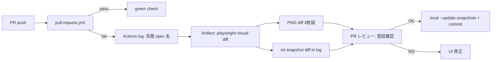

# Playwright ハイブリッド Visual 実装設計

**対象**: `blog-affiliate-pipeline`（Astro 静的サイト / sim-hikari-guide.com）  
**関連**: [e2e-publish-check-design.md](./e2e-publish-check-design.md)（P0/P1/P2 機能 E2E）、[visual-regression-design.md](./visual-regression-design.md)（方式選定）  
**ステータス**: 実装設計（P0 実装済み — `feature/playwright-visual-p0`）  
**作成日**: 2026-07-19

---

## 1. 目的とスコープ

### 1.1 目的

P0〜P2 の Node ベース E2E（MD / dist / 本番 smoke）に加え、**UI レイアウト回帰**と**主要 DOM テキストの決定的スナップショット**を Playwright で検知する。PR レビュー時に「見た目」と「構造テキスト」の両方を diff 可能にする。

### 1.2 ハイブリッド方式

| レイヤ     | Playwright API                             | 検知対象                                           | baseline 形式   |
| ---------- | ------------------------------------------ | -------------------------------------------------- | --------------- |
| **Visual** | `expect(locator).toHaveScreenshot()`       | レイアウト・色・余白・コンポーネント配置           | PNG（`*.png`）  |
| **Text**   | `expect(locator).toMatchSnapshot('*.txt')` | 見出し・本文抜粋・ナビ・フッター等の正規化テキスト | `.txt` snapshot |

Visual はピクセル差分、Text は PR diff で読みやすい行単位差分。同一 spec 内で両方を実行し、失敗時は GitHub Actions artifact と PR コメントで原因を切り分ける。

### 1.3 初期対象ページ（3 URL）

| URL                          | 役割                                         | Visual 対象                           | Text 対象                            |
| ---------------------------- | -------------------------------------------- | ------------------------------------- | ------------------------------------ |
| `/contact`                   | 静的フォームページ（env 依存メッセージあり） | `main` 全体（フォーム状態を mask）    | `h1` + 注意書き段落                  |
| `/sim`                       | カテゴリ Hub（記事一覧・フィルタ）           | `.category-hub`                       | ヒーロー + 先頭 3 記事タイトル       |
| `/articles/sim-20gb-osusume` | 比較記事テンプレート（affiliate 含む）       | `.article-shell`（日付・広告枠 mask） | ヒーロー + 結論サマリ + 比較表見出し |

### 1.4 スコープ外（初回実装）

- Percy / Chromatic 等クラウド visual サービス
- 全記事・全 Hub の網羅 screenshot
- axe-core 自動アクセシビリティ（将来 P2+ オプション）
- Vercel Preview URL を baseURL にする PR 連動 visual（Phase 2 拡張）

---

## 2. ファイル構成

```
blog-affiliate-pipeline/
├── site/
│   ├── playwright.config.ts          # webServer, snapshotPathTemplate, projects
│   ├── package.json                    # devDependencies: @playwright/test, scripts 追加
│   └── tests/
│       └── visual/
│           ├── fixtures/
│           │   └── pages.ts            # 対象 URL・locator・snapshot 名
│           ├── helpers/
│           │   ├── stabilize-page.ts   # font 固定, animation 無効, mask 定義
│           │   └── normalize-text.ts   # whitespace / 連続空白正規化
│           ├── contact.visual.spec.ts
│           ├── sim-hub.visual.spec.ts
│           └── article-template.visual.spec.ts
│           └── *-snapshots/            # PNG + txt baselines — Git 管理
├── .github/workflows/
│   ├── ci.yml                          # 変更なし: format / test / build / validate-dist
│   └── pull-request.yml                # PR 専用: Playwright visual + text
└── package.json                        # test:e2e:visual 等（site へ委譲）
```

### 2.1 `site/playwright.config.ts` 要点

| 設定                                        | 値                                                                 | 理由                           |
| ------------------------------------------- | ------------------------------------------------------------------ | ------------------------------ |
| `testDir`                                   | `tests/visual`                                                     | 機能 E2E（Node scripts）と分離 |
| `webServer.command`                         | `npm run build && npm run preview -- --host 127.0.0.1 --port 4321` | 本番同等静的配信               |
| `webServer.url`                             | `http://127.0.0.1:4321`                                            | Astro preview 既定             |
| `use.baseURL`                               | `http://127.0.0.1:4321`                                            | 相対 `page.goto`               |
| `use.viewport`                              | `{ width: 1280, height: 720 }`                                     | Desktop baseline 固定          |
| `expect.toHaveScreenshot.maxDiffPixelRatio` | `0.01`                                                             | 軽微アンチエイリアス許容       |
| `snapshotPathTemplate`                      | `{testDir}/{testFilePath}-snapshots/{arg}{ext}`                    | text snapshot パス統一         |
| `workers`                                   | CI: `1`, local: `2`                                                | visual flaky 低減              |
| `retries`                                   | CI: `1`, local: `0`                                                | 初回 flaky 吸収                |

### 2.2 npm scripts 統合

| script                   | 内容                                                                  | 既存 E2E との関係              |
| ------------------------ | --------------------------------------------------------------------- | ------------------------------ |
| `test:e2e`               | **変更なし** — validate-articles → build → validate-dist              | P0 機能 E2E（Playwright 不含） |
| `test:e2e:visual`        | `npm run test:e2e:visual --prefix site`（site 内: `playwright test`） | visual 専用                    |
| `test:e2e:visual:update` | `npm run test:e2e:visual:update --prefix site`                        | baseline 更新（ローカル）      |
| `test:e2e:all`           | `npm run test:e2e && npm run test:e2e:visual`                         | ローカル全量（任意）           |

CI では **`ci.yml` は変更せず**（format / test / build / validate-dist）、Playwright visual は **別 workflow `pull-request.yml`** で PR 時のみ実行する。

---

## 3. ページ別 spec 設計

### 3.1 共通前処理（`stabilize-page.ts`）

```typescript
// 実装時の処理順
await page.addStyleTag({
  content: `
  *, *::before, *::after {
    animation-duration: 0s !important;
    transition-duration: 0s !important;
    caret-color: transparent !important;
  }
  * { font-family: system-ui, sans-serif !important; }
`,
});
await page.emulateMedia({ reducedMotion: "reduce" });
```

| mask 対象        | セレクタ / 方法                                      | 理由                  |
| ---------------- | ---------------------------------------------------- | --------------------- |
| 公開日・更新日   | `.article-hero time`, `[datetime]`                   | 日付変動              |
| A8 / VC バナー   | `a[href*="px.a8.net"], a[href*="valuecommerce.com"]` | トラッキング URL 変動 |
| 記事件数         | `.category-hero__count`                              | 記事追加で数字変動    |
| Contact フォーム | `.contact-form` または Formspree iframe              | env 有無で UI 差      |

### 3.2 `/contact` — `contact.visual.spec.ts`

| 種別   | Locator                                 | snapshot 名        |
| ------ | --------------------------------------- | ------------------ |
| Visual | `main`                                  | `contact-main.png` |
| Text   | `main h1, main > p, main h2 + p` を結合 | `contact-main.txt` |

**Text 正規化**: 連続空白→1スペース、trim。フォームブロックは text snapshot から除外（mask と同様）。

### 3.3 `/sim` — `sim-hub.visual.spec.ts`

| 種別   | Locator                                                                                            | snapshot 名        |
| ------ | -------------------------------------------------------------------------------------------------- | ------------------ |
| Visual | `.category-hub`                                                                                    | `sim-hub.png`      |
| Text   | `.category-hero__title, .category-hero__lead, .category-hub__item .article-card__title`（先頭3件） | `sim-hub-head.txt` |

記事一覧全体の text snapshot は行数が増えすぎるため、**先頭 3 件タイトルのみ**を固定。件数は `.category-hero__count` を mask し visual のみで検知。

### 3.4 `/articles/sim-20gb-osusume` — `article-template.visual.spec.ts`

| 種別   | Locator                                                                | snapshot 名                 |
| ------ | ---------------------------------------------------------------------- | --------------------------- |
| Visual | `.article-shell`                                                       | `article-sim-20gb.png`      |
| Text   | `.article-hero__title, .article-hero__lead, .article-body h2`（先頭5） | `article-sim-20gb-head.txt` |

比較表（`.prose table`）は Phase 1 では text snapshot に**含めない**（料金更新で頻繁に baseline 更新が必要）。Phase 2 拡張で table を正規化して追加可能。

---

## 4. Text snapshot セレクタ一覧（実装用）

| ページ                       | セレクタ                                       | 取得内容       | 正規化                          |
| ---------------------------- | ---------------------------------------------- | -------------- | ------------------------------- |
| `/contact`                   | `main h1`                                      | ページタイトル | trim                            |
| `/contact`                   | `main > p:first-of-type`                       | リード文       | env 分岐時は fixture env で固定 |
| `/contact`                   | `main h2:nth-of-type(1) + p`                   | 注意書き       | trim                            |
| `/sim`                       | `.category-hero__title`                        | Hub 見出し     | trim                            |
| `/sim`                       | `.category-hero__lead`                         | リード         | trim                            |
| `/sim`                       | `.category-hub__item .article-card__title` × 3 | 記事タイトル   | 順序固定（sort 済み）           |
| `/articles/sim-20gb-osusume` | `.article-hero__title`                         | 記事タイトル   | trim                            |
| `/articles/sim-20gb-osusume` | `.article-hero__lead`                          | description    | trim                            |
| `/articles/sim-20gb-osusume` | `.article-body h2` × 5                         | 見出し構造     | 番号付きリスト化して snapshot   |

**将来**: `data-testid="snapshot-*"` を Astro コンポーネントに追加するとセレクタ安定性が向上。初回は既存 class ベースで開始し、flaky が出た箇所のみ testid 追加。

---

## 5. CI 設計（`.github/workflows/pull-request.yml`）

### 5.1 workflow 概要

`ci.yml` は **変更しない**（Prettier / Vitest / unittest / validate-articles / build / validate-dist のみ）。Playwright visual は PR 専用 workflow として分離する。

```yaml
name: Pull Request

on:
  pull_request:
    branches: [main]
    paths:
      - "site/**"
      - ".github/workflows/pull-request.yml"

jobs:
  playwright-visual:
    runs-on: ubuntu-latest
    steps:
      - uses: actions/checkout@v6
      - uses: actions/setup-node@v6
        with:
          node-version: 22
          cache: npm
      - run: npm ci
      - working-directory: site
        run: npm ci
      - working-directory: site
        run: npx playwright install --with-deps chromium
      - working-directory: site
        run: npm run test:e2e:visual
        env:
          CI: true
          PUBLIC_CONTACT_FORM_ACTION: ""
      - name: Upload visual diff artifacts
        if: failure()
        uses: actions/upload-artifact@v4
        with:
          name: playwright-visual-diff
          path: |
            site/tests/visual/**/*-snapshots/**/*
            site/test-results/
          retention-days: 14
```

| 項目            | 設定                                                              |
| --------------- | ----------------------------------------------------------------- |
| トリガ          | **`pull_request` のみ**（`push` to main では実行しない）          |
| paths filter    | `site/**` 変更時。docs-only PR ではスキップ                       |
| ブラウザ        | Chromium のみ（初回）                                             |
| webServer       | Playwright config 内で build + preview を自動起動                 |
| 失敗時 artifact | `-expected.png`, `-actual.png`, `-diff.png`, text `-received.txt` |
| 所要時間目安    | build 60s + Playwright 30s ≒ 2分                                  |

### 5.2 `ci.yml` との役割分担

| Workflow           | トリガ               | 内容                                               |
| ------------------ | -------------------- | -------------------------------------------------- |
| `ci.yml`           | PR + push main       | format, test, build, validate-dist（**変更なし**） |
| `pull-request.yml` | PR（site/** 変更時） | Playwright visual + text snapshot                  |

---

## 6. Baseline 更新ワークフロー

### 6.1 ローカル更新（開発者）

```bash
# 1. site 変更後
npm run test:e2e:visual:update   # PNG + txt baseline 更新（site/ 配下）

# 2. 差分確認
git status site/tests/visual/
git diff site/tests/visual/

# 3. 意図した UI 変更のみ commit
git add site/tests/visual/
git commit -m "test(visual): update baselines for sim hub layout"
```

### 6.2 更新判断基準

| 変更種別                          | baseline 更新           | 代替                             |
| --------------------------------- | ----------------------- | -------------------------------- |
| 意図した CSS / コンポーネント変更 | ✅ 更新                 | PR に before/after スクショ添付  |
| 記事本文のみ（対象 slug 外）      | ❌ 不要                 | —                                |
| 記事追加で Hub 件数変更           | visual mask 済みなら ❌ | text は先頭3件固定のため通常不要 |
| フォント・OG 画像変更             | ✅ visual 更新          | —                                |
| flaky（環境差）                   | mask / stabilize 改善   | baseline 安易更新禁止            |

### 6.3 CI での baseline 更新（非推奨）

自動 `--update-snapshots` は main で実行しない。必ず PR 経由で baseline をレビューする。

---

## 7. PR diff レビュー UX

### 7.1 失敗時の開発者体験



### 7.2 GitHub Actions ログ出力（実装時）

失敗 step で以下を `GITHUB_STEP_SUMMARY` に書き出す:

```markdown
## Visual regression failed

| Spec                   | Type       | Snapshot         |
| ---------------------- | ---------- | ---------------- |
| sim-hub.visual.spec.ts | screenshot | sim-hub.png      |
| sim-hub.visual.spec.ts | text       | sim-hub-head.txt |

Download **playwright-visual-diff** artifact for PNG diffs.
Text diff: see job log / `git diff` locally after `npm run test:e2e:visual`.
```

### 7.3 PR レビューでの見方

| 種別         | レビュー方法                                                               | メリット                                                 |
| ------------ | -------------------------------------------------------------------------- | -------------------------------------------------------- |
| **PNG**      | artifact の `-diff.png` をダウンロード                                     | レイアウト崩れを一目で確認                               |
| **Text**     | Actions log の `Expected` / `Received` またはローカル `git diff` on `.txt` | GitHub PR Files タブで行 diff 可能（baseline commit 時） |
| **両方失敗** | text 先に確認 → 意図的コピー変更なら txt 更新、レイアウトのみなら PNG 更新 | 原因切り分け                                             |

### 7.4 Optional: PR コメント bot（Phase 2）

`actions/github-script` で artifact URL を PR コメント。初回は artifact + step summary のみで十分。

---

## 8. 既存 E2E との統合

### 8.1 実行順序（ローカル）

```
npm run test:e2e:local     # P0: generate → validate-articles → build → validate-dist
npm run test:e2e:smoke     # P1: 本番 URL（手動 / post-deploy WF）
npm run test:e2e:visual    # P2+: Playwright hybrid
```

### 8.2 CI パイプライン全体

| Job / WF                 | タイミング           | ツール                                                              |
| ------------------------ | -------------------- | ------------------------------------------------------------------- |
| `ci.yml → validate`      | PR / push main       | Prettier, Vitest, unittest, validate-articles, build, validate-dist |
| `pull-request.yml`       | PR（site/** 変更時） | Playwright visual + text                                            |
| `post-deploy-smoke.yml`  | push main（site/**） | smoke-production + changed-slugs                                    |
| `scheduled-articles.yml` | cron                 | generator + validate                                                |

Playwright は **dist 検証の後段**ではなく **`ci.yml` とは別 workflow**。どちらも `site build` を前提とするため、将来的に `validate` job の build artifact を `pull-request.yml` に渡して build 時間を共有できる（Phase 1.1 最適化）。

### 8.3 changed-slugs 連携（将来）

PR で変更された記事 slug に対し、固定 3 ページに加え **dynamic spec** を追加:

```typescript
// tests/visual/changed-articles.visual.spec.ts（Phase 2）
const slugs = process.env.E2E_VISUAL_SLUGS?.split(",") ?? [];
for (const slug of slugs) {
  test(`article/${slug} shell`, async ({ page }) => { ... });
}
```

`E2E_VISUAL_SLUGS` は `node scripts/e2e/changed-slugs.mjs --format=comma` から CI で注入。初回 3 ページ固定実装完了後に追加。

---

## 9. 依存関係とインストール

```json
{
  "devDependencies": {
    "@playwright/test": "^1.52.0"
  },
  "scripts": {
    "test:e2e:visual": "playwright test",
    "test:e2e:visual:update": "playwright test --update-snapshots",
    "test:e2e:visual:ui": "playwright test --ui"
  }
}
```

初回セットアップ: `npx playwright install chromium`（CI は `--with-deps`）。

---

## 10. 実装タスク分解

| 順序 | タスク                        | 成果物                                    | 目安 |
| ---- | ----------------------------- | ----------------------------------------- | ---- |
| 1    | Playwright 導入 + config      | `site/playwright.config.ts`, package.json | 30m  |
| 2    | stabilize / normalize helpers | `site/tests/visual/helpers/*`             | 30m  |
| 3    | 3 ページ spec + 初回 baseline | `*.visual.spec.ts`, snapshots             | 1.5h |
| 4    | CI pull-request workflow      | `.github/workflows/pull-request.yml`      | 30m  |
| 5    | ドキュメント・npm script 更新 | README / e2e design リンク                | 15m  |
| 6    | changed-slugs 連動（任意）    | dynamic article spec                      | 1h   |

**完了定義**: ローカル `npm run test:e2e:visual` green、CI `pull-request.yml` green、意図的 CSS 変更で失敗→baseline 更新→再 green を確認。

---

## 11. リスクと対策

| リスク                       | 影響             | 対策                                                            |
| ---------------------------- | ---------------- | --------------------------------------------------------------- |
| フォント差（macOS vs Linux） | PNG flaky        | CI と同じ Ubuntu + system-ui 固定                               |
| 記事数増加                   | Hub layout 変化  | mask + text は先頭 N 件のみ                                     |
| baseline 肥大化              | repo size        | 3 ページ × 2 種 × 1 viewport のみ（初回 ≒ 6 PNG + 6 txt）       |
| build 二重実行               | CI 時間          | artifact 共有で Phase 1.1 改善                                  |
| Contact env 分岐             | text / visual 差 | CI では `PUBLIC_CONTACT_FORM_ACTION=""` を webServer env で固定 |

---

## 参照

- [e2e-publish-check-design.md](./e2e-publish-check-design.md)
- [visual-regression-design.md](./visual-regression-design.md)
- [Playwright test snapshots](https://playwright.dev/docs/test-snapshots)
- [Playwright webServer](https://playwright.dev/docs/test-webserver)

---

## 承認

実装に進む場合は、以下の文言で承認してください。

> **I agree with the design. Please start implementation.**
